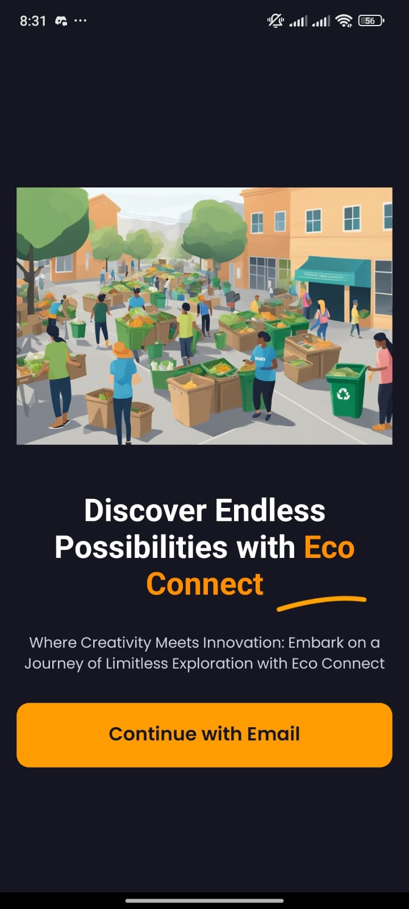
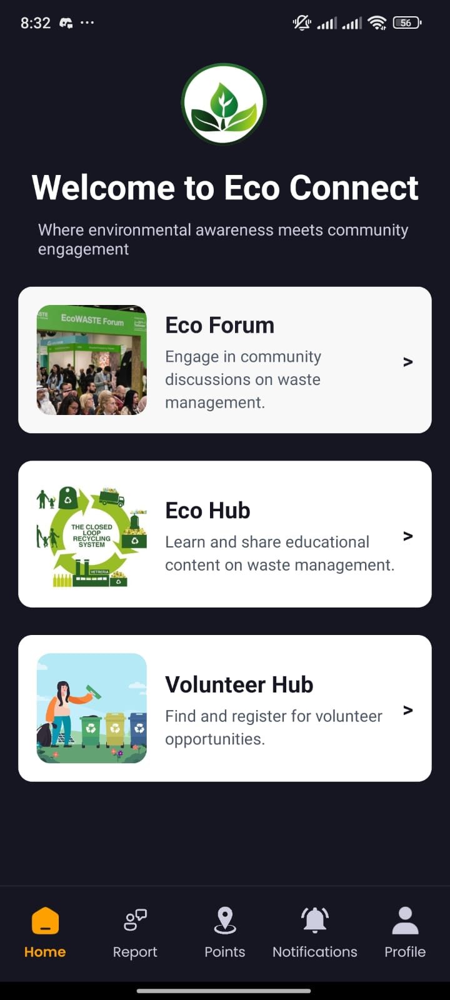

# Eco Connect

**Eco Connect** is a mobile application designed to foster environmental awareness and action by connecting individuals and communities around issues like cleanliness, waste management, and sustainability. Users can create accounts, join communities, report issues, organize and participate in volunteer events, and engage with educational content related to environmental protection.

## Features

- **User Accounts**: Sign up, sign in, and update profile details.
- **Community Engagement**: Join various communities focused on environmental cleanliness and waste management.
- **Event Creation**: Users can create events related to environmental actions. Other users can register as volunteers.
- **Issue Reporting**: Report waste management issues to be addressed by the community.
- **Notification System**: Stay updated with event notifications and other community activities.
- **Social Sharing**: Share environmental tips and educational content on social media.
- **Interactive Maps**: View nearby environmental issues and volunteer opportunities on a map.
- **Volunteer Opportunities**: Explore and participate in local community-driven events.

## Screenshots

Below are some screenshots demonstrating the key views of the app:

|  |  |  |
| -------------------------------- | -------------------------- | ---------------------------------- |
| Landing Screen                   | Home Screen                | Sign Up Screen                     |

|  |  |  |
| ---------------------------------------------------------- | -------------------------------------------------------------------------- | -------------------------------------------------------------------- |
| Issue Reporting                                            | Volunteer Opportunities                                                    | Community Engagement                                                 |

## Tech Stack

- **React Native**: For building cross-platform mobile applications.
- **Firebase**: For authentication and real-time notifications.
- **Mapbox**: For interactive maps.
